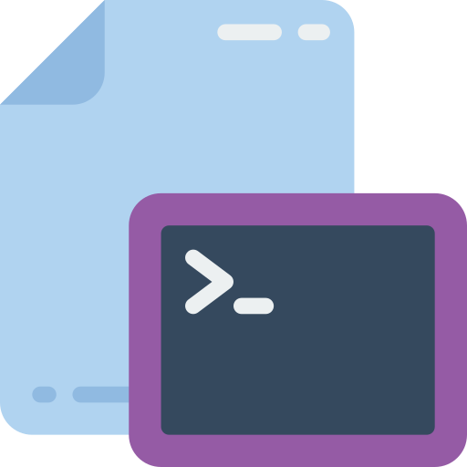

<p align="center">
  
</p>
<h3 align="center">Dotfiles</h3>
<p align="center">
    
    
</p>

---

# Dotfiles

A repository designed to automate the setup of a new computer. This script streamlines the installation and configuration of essential tools, applications, and system settings, ensuring a consistent and efficient setup process.

## Installation

Execute: 
```
./setup.sh
```

## After installation

There are a few things that need to be made manually:
- Setup Github SSH and GPG keys
- Setup Goland and Webstorm licenses
- Setup Balsamiq Wireframes license
- Setup Charles license
- Install Python version, using `pyenv`
- Install Node version, using `nvm`
- Install [Coin Tick app](apps/CoinTick.app.zip)
- Install [Battery Monitor: Health Info](https://apps.apple.com/us/app/battery-monitor-health-info/id836505650?mt=12)
- Configure Hot Corners
- Configure Battery Icon to show percentage
- Configure iTerm to [use the correct fonts](https://github.com/romkatv/powerlevel10k?tab=readme-ov-file#manual-font-installation)
